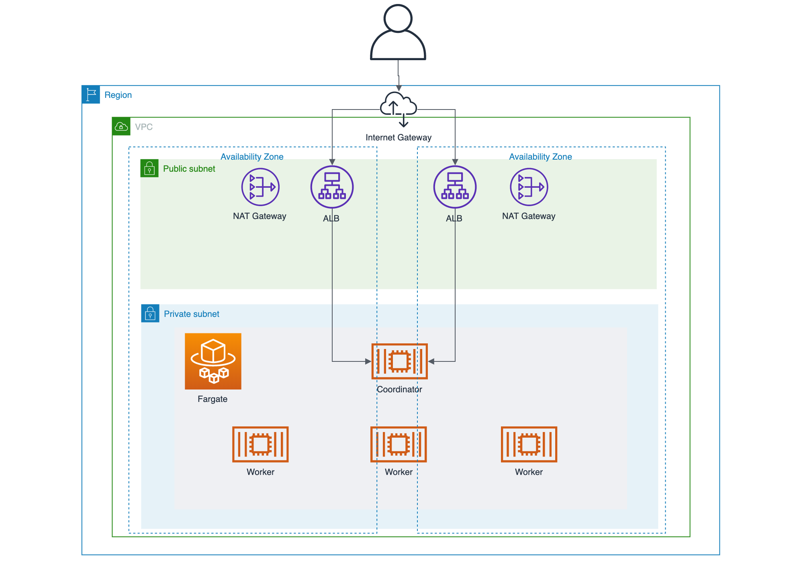

# terraform-aws-presto
Terraform module to create Presto cluster

# Usage

```terraform
module "presto" {
  source           = "github.com/Lewuathe/terraform-aws-presto"
  cluster_capacity = 2
}

output "alb_dns_name" {
  value = module.presto.alb_dns_name
}
```

You can connect to the Presto cluster through ALB.

```sh
$ ./presto-cli --server http://presto-XXXX.us-east-1.elb.amazonaws.com --catalog tpch --schema tiny
```

# Overview



# Variables

- `region`: AWS Region
- `vpc_cidr_block`: CIDR Block of the VPC where Presto cluster is running
  - `public_0_cidr_block`
  - `public_1_cidr_block`
  - `private_0_cidr_block`
  - `private_1_cidr_block`
- `cluster_capacity`: The number of tasks for worker process

# Outputs

- `alb_dns_name`: The DNS name of the ALB connecting to coordinator.